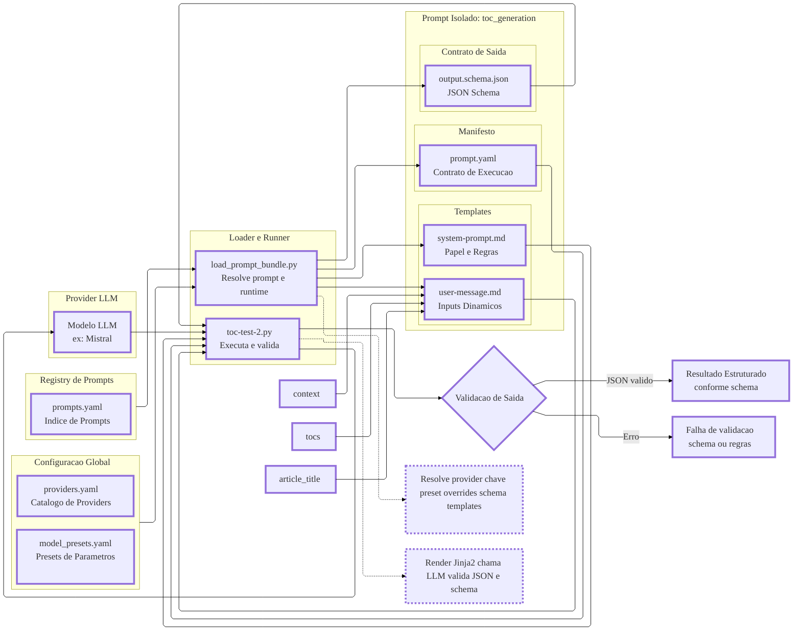

# CONTENT COPILOT REQUIREMENTS

| file | description |
|---|---|
| [`database.yaml`](https://) | Configuration for system database connections. |
| `prompts.yaml` | Predefined prompts for content generation. |
| `wordpress.yaml` | Settings for WordPress integration. |
| `providers.yaml` | Configuration for AI service providers. |
| `content.yaml`| Settings for content generation parameters. |
| `seo.yaml` | SEO settings and parameters. |

---

## VISÃO GERAL

Copiloto baseado em IA e desenvolvido em Python, projetado para automatizar a geração de conteúdos para blogs. 

A pipeline é composta por etapas sequenciais que envolvem a ingestão de fontes, parametrização da geração, transacionamento de dados com MongoDB, interação APIs de IA (Gemini, Mistral, Groq, Ollama, etc.) e integração com WordPress para publicação.




---

## ESTRUTURA DE PASTAS E ARQUIVOS

```
content-copilot/
├── configs/
│   ├── providers.yaml
│   └── model_presets.yaml
└── core/
    ├── prompts/
    │   ├── prompts.yaml
    │   └── toc_generation/
    │       ├── prompt.yaml
    │       ├── template/
    │       │   ├── system-prompt.md
    │       │   └── user-message.md
    │       └── schemas/
    │           └── output.schema.json
    └── (scripts)/
        ├── toc-test-2.py
        └── load_prompt_bundle.py
```

#### DETALHAMENTO DA ESTRUTURA DE PASTAS E ARQUIVOS

| Item                                                     | Descrição                                                                                                                           |
| -------------------------------------------------------- | ----------------------------------------------------------------------------------------------------------------------------------- |
| [`content-copilot/`](.)                                       | Diretório raiz do sistema responsável por centralizar configurações, prompts e scripts de execução. Path: `content-copilot/` |
| [`configs/`](configs/)                                               | Pasta de configurações globais compartilhadas por todos os prompts e providers. Path: `configs/` |
| [`providers.yaml`](configs/providers.yaml)                                 | Define os providers disponíveis (ex.: Mistral), incluindo credenciais (`api_key` ou `env_api_key`) e defaults como `default_mode`. Path: `configs/providers.yaml` |
| [`model_presets.yaml`](configs/model_presets.yaml)                             | Define presets reutilizáveis de parâmetros de modelo (ex.: deterministic_json), usados para padronizar comportamento entre prompts. Path: `configs/model_presets.yaml` |
| [`core/`](core/)                                                  | Núcleo do sistema, contendo prompts e scripts de execução/validação. Path: `core/` |
| [`prompts/`](core/prompts/)                                          | Repositório de todos os prompts disponíveis no sistema, organizados por diretório. Path: `core/prompts/` |
| [`prompts.yaml`](core/prompts/prompts.yaml)                              | Índice (registry) de prompts: mapeia `id` → `path` e controla se o prompt está habilitado. Path: `core/prompts/prompts.yaml` |
| [`toc_generation/`](core/prompts/toc_generation/)                           | Diretório do prompt `toc_generation`, isolando manifesto, templates e schema. Path: `core/prompts/toc_generation/` |
| [`prompt.yaml`](core/prompts/toc_generation/prompt.yaml)                | Manifesto do prompt: define provider, modelo, preset, parâmetros, mensagens, schema de saída e regras de validação. Path: `core/prompts/toc_generation/prompt.yaml` |
| [`template/`](core/prompts/toc_generation/template/)                  | Pasta de templates de texto usados para gerar as mensagens enviadas ao LLM. Path: `core/prompts/toc_generation/template/` |
| [`system-prompt.md`](core/prompts/toc_generation/template/system-prompt.md)  | Template do system prompt: define o papel do modelo, regras de output e referência ao schema minificado. Path: `core/prompts/toc_generation/template/system-prompt.md` |
| [`user-message.md`](core/prompts/toc_generation/template/user-message.md)   | Template da mensagem do usuário, com placeholders para `context`, `tocs` e `article_title`. Path: `core/prompts/toc_generation/template/user-message.md` |
| [`schemas/`](core/prompts/toc_generation/schemas/)                   | Pasta que contém os contratos formais (schemas) associados ao prompt. Path: `core/prompts/toc_generation/schemas/` |
| [`output.schema.json`](core/prompts/toc_generation/schemas/output.schema.json) | JSON Schema que define a estrutura válida da resposta do modelo e é usado para validação. Path: `core/prompts/toc_generation/schemas/output.schema.json` |
| [`load_prompt_bundle.py`]((../../core/load_prompt_bundle.py))                                  | Script responsável por carregar configs e prompt, renderizar mensagens e montar um bundle de execução para inspeção ou integração. Path: `core/load_prompt_bundle.py` |
| [`toc-test-2.py`](../../core/toc-test-2.py)                                          | Script runner que declara inputs, renderiza templates, executa o provider (Mistral) e valida a resposta contra regras e schema. Path: `core/toc-test-2.py` |
| Arquitetura geral                                        | Baseada em isolamento de prompts, configuração declarativa em YAML, templates Jinja2 e validação forte via JSON Schema.             |
| Escolha do provider                                      | Determinada exclusivamente por `runtime.provider` no `prompt.yaml`.                                                                 |
| Uso de presets                                           | Controlado por `runtime.model_preset`, permitindo reaproveitamento e consistência de parâmetros entre prompts.                      |
| Uso de schemas                                           | Garante que o output do LLM seja estruturado, previsível e validável antes de ser usado pelo sistema.                               |
| Fluxo de execução                                        | Carrega configs → resolve prompt → resolve runtime → renderiza templates → executa modelo → valida JSON → retorna resultado.        |


---


## 2) ARQUITETURA DO FRAMEWORK DE PROMPTS

O sistema implementa um **framework de prompts** com:

* **Configuração global** (providers e presets) em YAML
* **Registro central de prompts** (`prompts.yaml`)
* **Prompt isolado por pasta**, com:

  * manifesto (`prompt.yaml`)
  * templates (`system-prompt.md` e `user-message.md`)
  * schema de saída (`output.schema.json`)
* **Loader/Runner** em Python para:

  * resolver provider/model/parâmetros
  * renderizar templates com variáveis de entrada
  * (opcional) executar a chamada ao LLM
  * validar a resposta contra schema e regras adicionais (ex.: JSON minificado, sem markdown)

Isso permite ter **vários prompts** com contratos e comportamentos diferentes, mantendo **padrões comuns** (presets e providers).

---

### COMPONENTES E RESPONSABILIDADES

#### A) CATÁLOGO DE PROVIDERS [`providers.yaml`](configs/providers.yaml)

Responsável por definir **como autenticar** e **defaults** específicos de cada provider.

Campos típicos por provider:

* `api_key` **ou** `env_api_key`
* `default_mode` (roteamento interno no seu framework)

Exemplo conceitual:

```yaml
providers:
  mistral:
    api_key: "...."
    default_mode: chat
```

**Regra principal:**

* O **prompt escolhe o provider** (`runtime.provider`)
* O `providers.yaml` só diz **como** obter chave e defaults do provider escolhido

---

#### B) PRESETS DE PARÂMETROS [`model_presets.yaml`](configs/model_presets.yaml)

Responsável por definir conjuntos padrão reutilizáveis:

* `deterministic_json` (temperatura baixa, estabilidade)
* `balanced_writing` (mais criatividade)

O manifesto do prompt referencia um preset via `runtime.model_preset`, e o runner faz merge:

1. carrega preset
2. sobrescreve com `runtime.parameters` (se houver)

**Resultado:** parâmetros finais por prompt sem duplicar config em todos os manifestos.

---

#### C) REGISTRY/ÍNDICE DE PROMPTS [`prompts.yaml`](core/prompts/prompts.yaml)

Responsável por listar “quais prompts existem” e onde estão no filesystem.

Campos mínimos:

* `id`
* `path`
* `enabled`

Isso permite que scripts/serviços façam:

* `prompt_id` → resolve pasta do prompt

Sem “hardcode” de caminhos.

---

#### D) PASTA DO PROMPT [`toc_generation/`](core/prompts/toc_generation/)

##### `prompt.yaml` (manifesto)

Responsável por descrever “como esse prompt roda”:

* `runtime.provider`: qual provider usar (ex.: `mistral`)
* `runtime.model`: qual modelo (ex.: `mistral-large-latest`)
* `runtime.mode`: roteamento interno (ex.: `chat`)
* `runtime.model_preset`: preset base
* `runtime.parameters`: overrides do preset
* `messages`: lista de mensagens com `role` + `template`
* `io.output.schema_ref`: onde está o schema
* `io.output.must_be_minified`: regra de formatação do output
* `validation`: regras adicionais (ex.: `disallow_markdown`, `schema.enabled`, etc.)

**Esse arquivo é o “contrato de execução” do prompt.**

##### `template/system-prompt.md`

Responsável por instruções fixas e de alto nível:

* papel do modelo
* regras do output (somente JSON, minificado, sem explicação)
* referência ao schema (geralmente injetado como variável `output_schema_minified`)

##### `template/user-message.md`

Responsável por “como os inputs entram”:

* placeholders: `{{context}}`, `{{tocs}}`, `{{article_title}}`

##### `schemas/output.schema.json`

Responsável por validar estruturalmente o retorno:

* tipos
* campos obrigatórios
* limites (ex.: proposals = 3, H2 min/max, total_h3 min/max)
* `additionalProperties: false` (evita “lixo” no JSON)

---

### 2.3 Fluxo de execução (passo a passo)

1. **Carrega configs globais**

   * `providers.yaml`
   * `model_presets.yaml`

2. **Resolve o diretório do prompt**

   * lê `core/prompts/prompts.yaml`
   * encontra entrada com `id = toc_generation`
   * resolve `core/prompts/<path>/`

3. **Carrega manifesto do prompt**

   * `prompt.yaml`

4. **Resolve runtime**

   * pega `runtime.provider` → encontra `providers[provider]`
   * obtém `api_key` (direto ou via env var)
   * calcula `mode` = `runtime.mode` ou `provider.default_mode`
   * calcula `parameters` = `preset` + `runtime.parameters` (override)

5. **Carrega schema**

   * `io.output.schema_ref` → carrega JSON Schema
   * minifica schema para injetar no system (opcional, mas você já faz)

6. **Declara inputs dinâmicos**

   * `context`, `tocs`, `article_title` (dados do seu caso de uso)

7. **Renderiza templates**

   * Jinja2 substitui placeholders
   * produz `messages_rendered` no formato `{role, content}`

8. **(Opcional) Executa o provider**

   * para Mistral: `client.chat.complete(model=..., messages=..., **params)`

9. **Valida output**

   * JSON parse
   * “minified” (se exigido)
   * schema validation (JSON Schema)
   * regras extra (sem markdown etc.)

10. **Entrega o resultado**

* JSON final estruturado no schema do prompt

---

### 2.4 Regras e decisões de design importantes

#### A) “Prompt escolhe provider”

* `prompt.yaml` define `runtime.provider`
* evita acoplamento do prompt a um provider “default global”
* facilita rodar o mesmo prompt em providers diferentes (basta mudar o manifesto)

#### B) Templates separados do manifesto

* reduz diffs e conflitos
* permite editar textos grandes sem tocar no YAML
* permite lint/format/controle do conteúdo do prompt

#### C) Schema como contrato de saída

* reduz alucinação estrutural
* permite “fail fast” e retry automático
* permite evoluir versões do schema (`schema_version`)

---

### 2.5 Recomendações práticas (robustez)

1. **Não logar `api_key` no bundle**

   * mantenha apenas `api_key_present` e `api_key_source`

2. **Normalização de parâmetros por provider**

   * Mistral tende a usar `max_tokens`
   * seus presets usam `max_output_tokens`
   * mantenha um mapeamento por provider (ex.: `max_output_tokens → max_tokens`)

3. **Validação “minified JSON”**

   * na prática, muitos modelos retornam JSON com espaços
   * opção A: falhar e retry
   * opção B: auto-minificar antes de validar schema (mais pragmático)

4. **Camada de “Retry Policy”**

   * definida em `prompt.yaml` (max_retries, strategy)
   * runner aplica quando falha JSON/schema/minify

---


---


## PIPELINE DE GERAÇÃO DE CONTEÚDO

### GERAR IDEIAS DE TÍTULOS E TOC

#### FLOW DIAGRAM

O diagrama a seguir está em desenvolvimento, e deve ser considerado como provisório.

A evolução, refinamento e atualização do diagrama será realizada conforme a análise e o desenvolvimento do módulo de geração de conteúdo avance.

```mermaid---
---
config:
  theme: default
  themeVariables:
    background: '#ffffff'

    primaryColor: '#ffffff'
    primaryBorderColor: '#000000'
    primaryTextColor: '#000000'

    secondaryColor: '#f0f0f0'
    secondaryBorderColor: '#000000'
    secondaryTextColor: '#000000'

    tertiaryColor: '#ffffff'
    tertiaryBorderColor: '#000000'
    tertiaryTextColor: '#000000'

    lineColor: '#000000'

    # Fonte (ExtraBold será usada se disponível no ambiente)
    fontFamily: 'Ubuntu, Arial, Helvetica, sans-serif'
    fontSize: 16px

  look: classic
  layout: fixed
---
flowchart TB
 subgraph H0["<br><br>Obter HTML das Fontes<br><br>"]
    direction TB
        H1["<b>Obtem o link da fonte para analise</b>"]
        H2["Acessa o link e obtem os metadados"]
        H3["Persiste metadados na collection original_sources"]
        H4["Obtem o HTML completo da pagina"]
        H5["Sanitiza o HTML e mantem apenas texto"]
        H6["Persiste o HTML sanitizado"]
        HD{"Ainda existem itens para processar"}
  end
 subgraph A0["<b><br><br>IA Analisar e resumir Fontes<br><br><br><br></b>"]
    direction TB
        A1["Carrega HTML sanitizado"]
        A2["Carrega prompt content-analysis"]
        A3["Envia prompt e conteudo para a IA"]
        A4["IA analisa o conteudo da fonte"]
        A5["Normaliza resposta da IA"]
        A6["Persiste o conteudo"]
        AD{"Existem itens<br>para processar"}
  end
 subgraph C0["<br><br>IA Consolidar e construir contexto"]
    direction TB
        C1["Obtem resumo de todas as fontes"]
        C2["Concatena resumos em texto unico"]
        C3["Obtém TOC e todas as fontes"]
        C4["Concatena TOC das fontes"]
        C5["Carrega prompt build-source-context"]
        C6["Monta <br>USER MESSAGE"]
        C7["Envia prompt e conteudo para a IA"]
        C8["IA responde conforme o formato"]
        C9["Normaliza resposta"]
        C10["Persiste conteudo final"]
  end
 subgraph s1["<b><br>INÍCIO<br></b><br>"]
        START(("start"))
        S1["Iniciar fluxo<br>geracao de ideias"]
        S2["Disponibiliza interface<br>do modulo de geracao<br>de conteudo"]
        U1["Informa os links dos conteudos<br>que deverao ser considerados<br>para gerar as ideias"]
        U2["Configura as opcoes de geracao"]
        U3["Solicita a geracao"]
        n2(("executa fluxo<br>EXTRAÍR HTML"))
        n1["Persiste os dados da solicitação <br>no banco de dados"]
  end
    START --> S1
    S1 --> S2
    S2 --> U1
    U1 --> U2
    U2 --> U3
    H1 --> H2
    H2 --> H3
    H3 --> H4
    H4 --> H5
    H5 --> H6
    H6 L_H6_HD_0@==> HD
    HD L_HD_H1_0@== SIM ==> H1
    A1 L_A1_A2_0@--> A2
    A2 --> A3
    A3 --> A4
    A4 --> A5
    A5 --> A6
    A6 --> AD
    AD -- SIM --> A1
    C1 --> C2
    C2 --> C3
    C4 L_C4_C5_0@--> C5
    C5 --> C6
    C6 --> C7
    C7 L_C7_C8_0@--> C8
    C8 --> C9
    C9 --> C10
    U3 --> n1
    n1 --> n2
    n2 --> H1
    HD --> A1
    AD -- NAO --> C1
    C3 --> C4

    H2@{ shape: proc}
    n1@{ shape: rounded}
     n2:::Sky
    classDef Pine stroke-width:1px, stroke-dasharray:none, stroke:#254336, fill:#27654A, color:#FFFFFF
    classDef Sky stroke-width:1px, stroke-dasharray:none, stroke:#374D7C, fill:#E2EBFF, color:#374D7C
    style H3 color:#000000,stroke:#D50000
    style HD stroke-width:4px,stroke-dasharray: 0
    style n2 stroke-width:4px,stroke-dasharray: 0,color:#000000,stroke:#00C853
    style A0 fill:#BBDEFB,stroke:#D50000
    style H0 color:#000000,stroke:#FFD600,fill:#FFF9C4
    style s1 fill:#C8E6C9
    style C0 fill:#FFE0B2,stroke:#2962FF

    L_H6_HD_0@{ animation: slow } 
    L_HD_H1_0@{ curve: linear, animation: slow } 
    L_A1_A2_0@{ curve: linear } 
    L_C4_C5_0@{ animation: slow } 
    L_C7_C8_0@{ curve: linear }
    
```




---

### Inicialização do Fluxo

1. Usuário insere links das fontes e informações adicionais em texto livre, como público-alvo, estilo de escrita, etc.
2. Configura opções de geração, como quantidade de Ideias de Conteúdo a serem geradas, se permite ou não o uso de fontes na internet, etc.
3. Solicita a geração de ideias/conteúdo. 

## **PROCESSAMENTO INICIAL DAS FONTES**
   
Para cada link fornecido,o sistema deverá acessar o link e>

### OBTER HTML

- Obter o html completo da página
- Persistir o HTML completo na collection `original_sources` (campo `raw_html`)

---


### OBTER METADADOS

1. Analisar o conteúdo do html original  salvo no campo `raw_html` e extrair os seguintes metadados: 
    - Título h1
    - Meta descrição
    - URL canônica [se disponível]
    - Data de publicação [se disponível]
    - Categoria Principal [se disponível]
    - Outras categorias [se disponível]
    - Tags [se disponível]
2. Persistir os metadados na collection `original_sources` (campos correspondentes)

---

### OBTER ESTRUTURA DE TÍTULOS (TOC)

1. Analisar o conteúdo do html original  salvo no campo `raw_html` e :extrair a estrutura de títulos (TOC - Table of Contents), identificando os títulos h1, h2, h3, etc., e suas hierarquias.
2. Normalizar a estrutura de títulos em um formato hierárquico, para que possa ser facilmente identificado o nível de cada título.
3. Persistir essa estrutura na collection `original_sources` (campo `toc`).

---

### SANITIZAR HTML

Sanitizar HTML em Python removendo **scripts, CSS, tags perigosas e atributos indesejados**, mantendo:

* Texto “limpo”
* Tags de formatação: `<p> <a> <b>` (e outras que você escolher)
* Links (`href`) e texto do link
* Imagens com `src` e `alt`
* Legendas/descrições de imagens (ex.: `<figure><figcaption>...</figcaption></figure>`)

Para cada fonte,obter o HTML completo da página salvo no campo `raw_html` e realizar a sanitização conforme as etapas abaixo:

1. **Remover completamente:**

    * `<script>`, `<style>`, `<noscript>`, `<iframe>`, `<object>`, `<embed>`, `<svg>`, etc.
    * Comentários HTML
    * Meta/headers não úteis (opcional): `<head>`, `<meta>`, `<link>`

2. **Tags típicas para manter (exemplo):**

    * Texto/estrutura: `p, br, ul, ol, li, blockquote`
    * Formatação: `b, strong, i, em, u, code, pre`
    * Links: `a`
    * Imagens: `img, figure, figcaption`

3. **Atributos permitidos (exemplo mínimo e seguro):**
    * Para `<a>`: `href`, `title` (opcional)
    * Para ``: `src`, `alt`, `title` (opcional)
    * Para `<figure>/<figcaption>`: geralmente nenhum atributo necessário

4. **Regras adicionais:**

    * Remover **todos** os atributos `on*` (ex.: `onclick`)
    * Remover `style` e `class` (ou manter `class` apenas se você precisar)
    * Bloquear protocolos perigosos em links: `javascript:`, `data:` (exceto se você decidir permitir `data:image/...`)

5. **Persistir o HTML**

    * Após a sanitização, persistir o HTML sanitizado na collection `original_sources` (campo `sanitized_html`).
---

        
### ANALISE INICIAL DOS CONTEÚDOS COM IA
   
Para cada fonte processada, o sistema deverá:

1. obter o HTML sanitizado salvo no campo `sanitized_html`.
2. Carregar o prompt `initial-content-analysis`
3. Montar a *user message* com o conteúdo do HTML sanitizado.
4. Enviar o prompt e o conteúdo da fonte para a IA
5. A IA analisa e responde com um resumo do conteúdo da fonte, no formato e com os campos especificados abaixo:
    * Título Principal
    * Resumo do Conteúdo (máx. 300 palavras)
    * Principais Assuntos (lista)
6. Exemplo de formato de resposta da IA:
    
    ```markdown
    # [Título extraído pela IA]

    ## Resumo:
    [Resumo extraído pela IA]

    ## Principais Assuntos:
    - Ponto 1
    - Ponto 2
    - Ponto 3
    ```
7. Receber a resposta da IA e normalizar o conteúdo, extraindo os campos conforme o formato especificado.
8. Persistir o conteúdo analisado no documento correspondente da collection `original_sources`, nos campos:
    
    * `ia_analysis.title`
    * `ia_analysis.summary`
    * `ia_analysis.key_points` (array)  

---

### CONSTRUIR DO CONTEXTO 

O sistema deverá gerar um contexto detalhado para ser utilizado como base de conhecimento do módulo de IA durante a geração de ideias/conteúdo. Para isso, deverá:

1. Obter os resumos de todas as fontes previamente criados pela IA (campo `ia_analysis.summary`).
    2.1 Concatenar todos os resumos em um único texto.
    2.2 Identificar o início e fim de cada resumo utilizando "## RESUMO 1: [TÍTULO DO ARTIGO]", "## RESUMO 2: [TÍTULO DO ARTIGO]", etc. 
    2;3 Armazenar esse conteúdo concatenado em variável para uso posterior.
2. Obter a estrutura de títulos (TOC) de todas as fontes (campo `toc`).
    3.1 Concatenar as estruturas de títulos em um único texto.
    3.2 Identificar o início e fim de cada TOC utilizando "## TOC 1: [TÍTULO DO ARTIGO]", "## TOC 2: [TÍTULO DO ARTIGO]", etc.
    3.3 Armazenar esse conteúdo concatenado em variável para uso posterior.
3. Carregar o prompt `build-source-context`.
4. Montar a *user message* com o conteúdo consolidado dos resumos e TOCs.
5. Enviar o prompt e o conteúdo para a IA.
6. A IA gera a resposta conforme o formato especificado abaixo:
    * Contexto Consolidado
    * Formato Markdown otimizado para leitura por modelos de IA
7. Receber a resposta da IA e normalizar o conteúdo.
8. Persistir o conteúdo final no documento correspondente da collection `content_generation_requests`, no campo `initial_context`.

---

### GERAR IDEIAS DE TÍTULOS DE CONTEÚDO

1. Utilizar o contexto construído na etapa anterior como base de conhecimento e contextualização da IA.
2. Carregar o prompt `content-ideas-generation`.
3. Montar a *user message* com as informações adicionais fornecidas pelo usuário (público-alvo, estilo de escrita, etc.) e o contexto inicial.,
4. Enviar o prompt e o conteúdo para a IA.
5. A IA gera as ideias de títulos de novos artigos conforme o formato especificado abaixo:
    * Lista de Títulos de Ideias de Conteúdo (máx. conforme configuração)
    * Formato JSON estruturado e otimizado para fácil parsing
    * Exemplo de formato de resposta da IA:
    
    ```json
    {
      "content_ideas": [
        "Título da Ideia 1",
        "Título da Ideia 2",
        "Título da Ideia 3"
      ]
    }
    ```
6. Receber a resposta da IA e normalizar o conteúdo, extraindo a lista de títulos conforme o formato especificado.
7. Persistir as ideias de conteúdo no documento correspondente da collection `content_generation_requests`, no campo `generated_title_ideas`.
8. Disponibilizar as ideias geradas na interface para o usuário revisar e selecionar o título desejado.
9. Persistir a seleção do título feita pelo usuário no documento correspondente da collection `content_generation_requests`, no campo `selected_title`.
10. Continuar para o próximo passo. 


---

### GERAR TOC DO CONTEÚDO

Utilizando o conteúdo do contexto do tema (campo `initial_context`) e o título selecionado pelo usuário (campo `selected_title`), o sistema deverá:


1. Obter todos os TOCs das fontes previamente processadas (campo `toc`).
2. Concatenar todas as TOCs em um único texto.
    2.1 Identificar o início e fim de cada TOC utilizando "## TOC 1: [TÍTULO DO ARTIGO]", "## TOC 2: [TÍTULO DO ARTIGO]", etc.
3. Carregar o prompt `content-toc-generation`.
4. Montar a *user message*  incluindo o contexto do tema, a ideia de título selecionada pelo usuário e o conteúdo consolidado dos TOCs.
5. Enviar o prompt e o conteúdo para a IA.
6. A IA responderá em formato JSON estruturado, com três diferentes propostas de estrutura de títulos.
    1. **Tipos de TOCS**
        - **Proposta 1**: Baseada na estrutura com os títulos e subtítulos mais recorrentes e frequentes otimizada para seo e geo. 
        - **Proposta 2**: Baseado nos títulos e subtítulos mais frequente, porém adicionando novos subtítulos relevantes identificados nas outras estruturas analisadas, otimizada para seo e geo. 
        - **Proposta 3**: Pesquisar conteúdos relacionados para ampliar a estrutura base com novos títulos e subtítulos otimizados para SEO e GEO.
    2. **Exemplo JSON**
    ```json
    
7. Receber a resposta da IA e normalizar o conteúdo, extraindo as três propostas de TOC conforme o formato especificado.
8. Persistir as propostas de TOC no documento correspondente da collection `content_generation_requests`, no campo `generated_toc_proposals`.
9. Disponibilizar as propostas geradas na interface para o usuário revisar e selecionar a estrutura desejada.
10. Persistir a seleção feita pelo usuário no documento correspondente da collection `content_generation_requests`, no campo `selected_toc`.
11. Continu


Crie um prompt com as seguintes INFO

## INFORMAÇÕES E REQUISITOS DO PROMPTS