---

## WORKFLOW DIAGRAM

O diagrama a seguir está em desenvolvimento, e deve ser considerado como provisório.

A evolução, refinamento e atualização do diagrama será realizada conforme a análise e o desenvolvimento do módulo de geração de conteúdo avance.

```mermaid---
---
config:
  theme: default
  themeVariables:
    background: '#ffffff'

    primaryColor: '#ffffff'
    primaryBorderColor: '#000000'
    primaryTextColor: '#000000'

    secondaryColor: '#f0f0f0'
    secondaryBorderColor: '#000000'
    secondaryTextColor: '#000000'

    tertiaryColor: '#ffffff'
    tertiaryBorderColor: '#000000'
    tertiaryTextColor: '#000000'

    lineColor: '#000000'

    # Fonte (ExtraBold será usada se disponível no ambiente)
    fontFamily: 'Ubuntu, Arial, Helvetica, sans-serif'
    fontSize: 16px

  look: classic
  layout: fixed
---
flowchart TB
 subgraph H0["<br><br>Obter HTML das Fontes<br><br>"]
    direction TB
        H1["<b>Obtem o link da fonte para analise</b>"]
        H2["Acessa o link e obtem os metadados"]
        H3["Persiste metadados na collection original_sources"]
        H4["Obtem o HTML completo da pagina"]
        H5["Sanitiza o HTML e mantem apenas texto"]
        H6["Persiste o HTML sanitizado"]
        HD{"Ainda existem itens para processar"}
  end
 subgraph A0["<b><br><br>IA Analisar e resumir Fontes<br><br><br><br></b>"]
    direction TB
        A1["Carrega HTML sanitizado"]
        A2["Carrega prompt content-analysis"]
        A3["Envia prompt e conteudo para a IA"]
        A4["IA analisa o conteudo da fonte"]
        A5["Normaliza resposta da IA"]
        A6["Persiste o conteudo"]
        AD{"Existem itens<br>para processar"}
  end
 subgraph C0["<br><br>IA Consolidar e construir contexto"]
    direction TB
        C1["Obtem resumo de todas as fontes"]
        C2["Concatena resumos em texto unico"]
        C3["Obtém TOC e todas as fontes"]
        C4["Concatena TOC das fontes"]
        C5["Carrega prompt build-source-context"]
        C6["Monta <br>USER MESSAGE"]
        C7["Envia prompt e conteudo para a IA"]
        C8["IA responde conforme o formato"]
        C9["Normaliza resposta"]
        C10["Persiste conteudo final"]
  end
 subgraph s1["<b><br>INÍCIO<br></b><br>"]
        START(("start"))
        S1["Iniciar fluxo<br>geracao de ideias"]
        S2["Disponibiliza interface<br>do modulo de geracao<br>de conteudo"]
        U1["Informa os links dos conteudos<br>que deverao ser considerados<br>para gerar as ideias"]
        U2["Configura as opcoes de geracao"]
        U3["Solicita a geracao"]
        n2(("executa fluxo<br>EXTRAÍR HTML"))
        n1["Persiste os dados da solicitação <br>no banco de dados"]
  end
    START --> S1
    S1 --> S2
    S2 --> U1
    U1 --> U2
    U2 --> U3
    H1 --> H2
    H2 --> H3
    H3 --> H4
    H4 --> H5
    H5 --> H6
    H6 L_H6_HD_0@==> HD
    HD L_HD_H1_0@== SIM ==> H1
    A1 L_A1_A2_0@--> A2
    A2 --> A3
    A3 --> A4
    A4 --> A5
    A5 --> A6
    A6 --> AD
    AD -- SIM --> A1
    C1 --> C2
    C2 --> C3
    C4 L_C4_C5_0@--> C5
    C5 --> C6
    C6 --> C7
    C7 L_C7_C8_0@--> C8
    C8 --> C9
    C9 --> C10
    U3 --> n1
    n1 --> n2
    n2 --> H1
    HD --> A1
    AD -- NAO --> C1
    C3 --> C4

    H2@{ shape: proc}
    n1@{ shape: rounded}
     n2:::Sky
    classDef Pine stroke-width:1px, stroke-dasharray:none, stroke:#254336, fill:#27654A, color:#FFFFFF
    classDef Sky stroke-width:1px, stroke-dasharray:none, stroke:#374D7C, fill:#E2EBFF, color:#374D7C
    style H3 color:#000000,stroke:#D50000
    style HD stroke-width:4px,stroke-dasharray: 0
    style n2 stroke-width:4px,stroke-dasharray: 0,color:#000000,stroke:#00C853
    style A0 fill:#BBDEFB,stroke:#D50000
    style H0 color:#000000,stroke:#FFD600,fill:#FFF9C4
    style s1 fill:#C8E6C9
    style C0 fill:#FFE0B2,stroke:#2962FF

    L_H6_HD_0@{ animation: slow } 
    L_HD_H1_0@{ curve: linear, animation: slow } 
    L_A1_A2_0@{ curve: linear } 
    L_C4_C5_0@{ animation: slow } 
    L_C7_C8_0@{ curve: linear }
    
```

