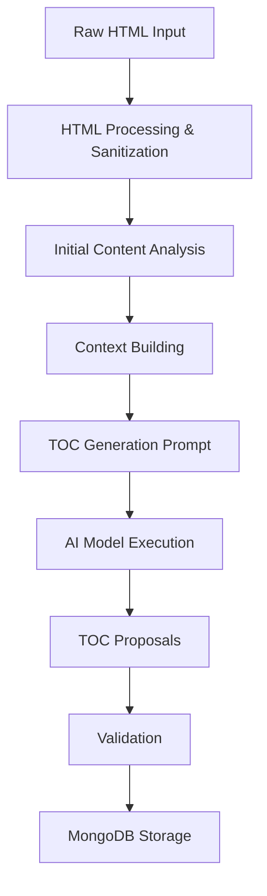

# CITO (Content Copilot) - Architecture Documentation

---

## **1. Introduction**

### **1.1 Purpose**
This document describes the **architecture** of the **CITO (Content Copilot)** system, focusing on the **Minimum Viable Product (MVP)**. It provides an overview of the system's components, data flows, and design decisions to ensure clarity and maintainability.

### **1.2 Scope**
The architecture described in this document covers:
- The **modular design** of the system.
- **Data flows** between components.
- **Integration** with AI providers and MongoDB.
- **Configuration management** and prompt framework.

Post-MVP features, such as WordPress integration, are not covered in this document.

### **1.3 Audience**
This document is intended for:
- **Developers** working on the CITO system.
- **Architects** reviewing the system design.
- **Project managers** overseeing the development of CITO.

---

## **2. Architectural Overview**

### **2.1 High-Level Architecture**
The CITO system follows a **modular architecture**, consisting of the following layers:

1. **Input Layer**: Handles raw HTML content and metadata extraction.
2. **Processing Layer**: Sanitizes content, performs initial analysis, and generates TOC proposals.
3. **AI Layer**: Interacts with AI models to generate content and analysis.
4. **Data Layer**: Stores and retrieves data from MongoDB.
5. **Configuration Layer**: Manages system configurations and prompt templates.

### **2.2 Components**
The system is composed of the following components:

| Component | Description |
|-----------|-------------|
| **Scripts** | Executable scripts for pipeline stages (e.g., `load_prompt_bundle.py`, `toc-test-2.py`). |
| **Prompts** | Modular prompts for AI interactions (e.g., `toc_generation`). |
| **Configurations** | YAML files for managing AI providers, model presets, and system settings. |
| **MongoDB** | NoSQL database for storing content, metadata, and AI-generated outputs. |
| **Utils** | Utility functions for HTML processing, validation, and logging. |

---

## **3. Component Details**

### **3.1 Scripts**
Scripts are responsible for executing and validating the content generation pipeline. They are located in the `core/scripts/` directory.

#### **Key Scripts**
| Script | Description |
|--------|-------------|
| `load_prompt_bundle.py` | Loads and renders prompt templates for AI model execution. |
| `toc-test-2.py` | Executes and validates the `toc_generation` prompt. |

### **3.2 Prompts**
Prompts are modular and isolated in individual directories (e.g., `core/prompts/toc_generation/`). Each prompt consists of:
- A **manifest file** (`prompt.yaml`) defining the prompt's metadata and structure.
- **Templates** for system and user messages (e.g., `template/system-prompt.md`).
- A **JSON schema** for validating AI model outputs (e.g., `schemas/output.schema.json`).

#### **Example Prompt Structure**
```yaml
id: toc_generation
description: Generates three TOC proposals for a blog article.

runtime:
  provider: mistral
  model: mistral-large-latest
  mode: chat
  model_preset: deterministic_json
  parameters:
    temperature: 0.3
    max_tokens: 2000

messages:
  - role: system
    template: template/system-prompt.md
  - role: user
    template: template/user-message.md

io:
  output:
    schema_ref: schemas/output.schema.json
    must_be_minified: true
```

### **3.3 Configurations**
Configurations are centralized in the `configs/` directory and include:

| File | Description |
|------|-------------|
| `providers.yaml` | Defines AI providers (e.g., Mistral, Groq, Gemini) and their API endpoints. |
| `model_presets.yaml` | Defines presets for AI model parameters (e.g., `deterministic_json`). |
| `prompts.yaml` | Registry of available prompts, mapping prompt IDs to their paths. |

### **3.4 MongoDB**
MongoDB is used to store:
- **Original content** (raw and sanitized HTML).
- **Metadata** (e.g., title, author, publication date).
- **TOC proposals** and AI-generated analysis.
- **Content generation requests** and their status.

#### **Collections**
| Collection | Description |
|------------|-------------|
| `original_sources` | Stores raw and sanitized HTML, metadata, and TOC proposals. |
| `content_generation_requests` | Stores context, generated titles, and TOC proposals for each request. |

### **3.5 Utils**
Utility functions are located in the `core/utils/` directory and include:
- **HTML processing**: Sanitization and text extraction.
- **Validation**: JSON schema validation for AI outputs.
- **Logging**: Error and execution logging.

---

## **4. Data Flow**

### **4.1 Content Generation Pipeline**
The following diagram illustrates the data flow in the CITO system:



### **4.2 Detailed Data Flow**
1. **HTML Processing**:
   - Raw HTML is processed and sanitized to extract meaningful text and metadata.
   - Output: Sanitized text and metadata.

2. **Initial Content Analysis**:
   - The sanitized text is analyzed to identify key themes, topics, and structure.
   - Output: Structured analysis (e.g., headings, topics).

3. **Context Building**:
   - The sanitized text, metadata, and analysis are combined into a context object.
   - Output: Context object for AI model execution.

4. **TOC Generation**:
   - The context object is passed to the `toc_generation` prompt.
   - The AI model generates three TOC proposals.
   - Output: TOC proposals in JSON format.

5. **Validation**:
   - TOC proposals are validated against a JSON schema.
   - Output: Validated TOC proposals.

6. **MongoDB Storage**:
   - Validated TOC proposals and metadata are stored in MongoDB.
   - Output: Persisted data in `original_sources` and `content_generation_requests` collections.

---

## **5. Design Decisions**

### **5.1 Modular Prompt Framework**
- **Decision**: Prompts are isolated in individual directories with their own templates and schemas.
- **Rationale**: This design ensures reusability, maintainability, and easy updates to prompts.

### **5.2 Centralized Configuration**
- **Decision**: Configurations are centralized in the `configs/` directory.
- **Rationale**: Centralized configurations simplify management and ensure consistency across the system.

### **5.3 JSON Schema Validation**
- **Decision**: AI model outputs are validated against JSON schemas.
- **Rationale**: Validation ensures that outputs conform to expected structures and reduces errors.

### **5.4 MongoDB for Data Storage**
- **Decision**: MongoDB is used for storing content, metadata, and AI-generated outputs.
- **Rationale**: MongoDB's flexible schema supports the dynamic nature of content and metadata.

---

## **6. References**
- [CITO Requirements Documentation](../requirements.md)
- [CITO Data Model Documentation](../data_model.md)
- [CITO Pipeline Documentation](../pipeline.md)
- [CITO Prompt Framework Documentation](../prompts.md)